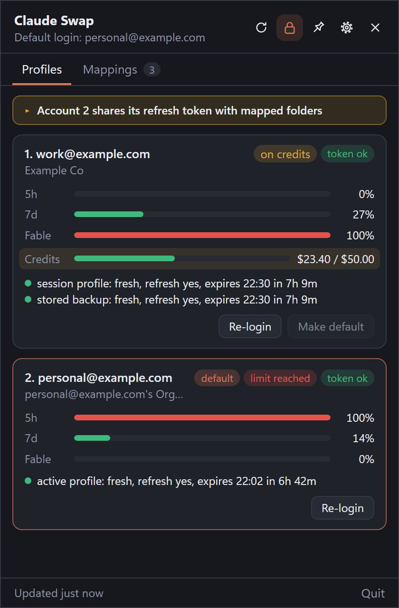
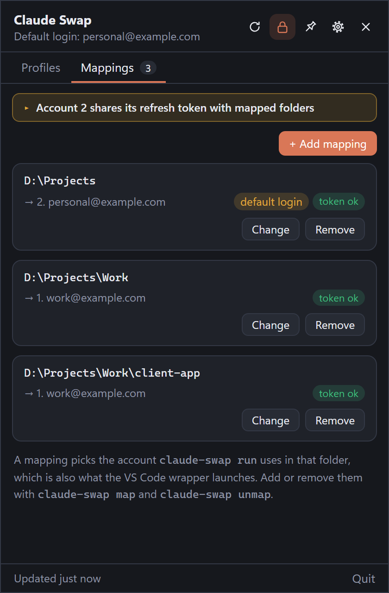
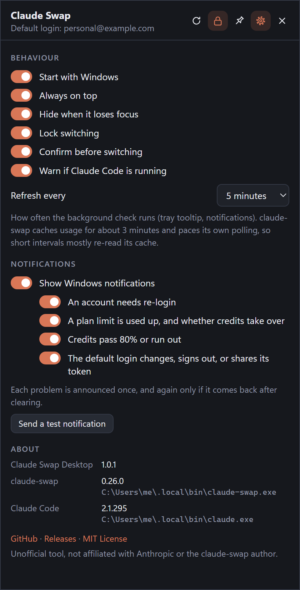

# Claude Swap Desktop

A small Windows tray app for [claude-swap](https://github.com/realiti4/claude-swap). It shows each
account's usage and token health, switches the default login, and runs a guided **re-login**.

Built with Tauri 2 (Rust + a plain HTML/JS popover, no frontend framework). The installer is about 1.7 MB; the
app is a single 7 MB exe, also offered as a [portable download](#install).
The UI and flow were inspired by [Claude-Swap-Desktop](https://github.com/adithyanraj03/Claude-Swap-Desktop)
(MIT). This is a separate implementation.

> **Unofficial.** A community tool, not affiliated with or endorsed by Anthropic or the author of claude-swap.
> "Claude" is a trademark of Anthropic. This app only drives the `claude-swap` and `claude` command-line tools
> already on your machine and never reads or stores your credentials itself.

| Profiles | Mappings | Settings |
|---|---|---|
|  |  |  |

<sub>Screenshots use placeholder accounts from the browser preview (see [Develop](#develop)).</sub>

## What it does

- **Accounts:** 5h / 7d / per-model usage from `claude-swap list --json`, extra-usage credits ($) while they're in
  use, plus token health per credential copy (active profile, session profile, stored backup) parsed from
  `claude-swap list --token-status`.
- **Warnings:**
  - the default login (`~/.claude`) is signed out
  - it's signed in as a different account than claude-swap thinks
  - the default-login account is also mapped to folders. Sessions there run from a session profile that shares
    one single-use refresh token with the default login, so one copy can invalidate the other.
- **Make default:** `claude-swap switch <n>`, behind the header's lock and a confirmation (both optional).
- **Mappings tab:** every `claude-swap map` entry with its on-disk path casing and account token health.
  - **Add / Change** (`claude-swap map <n> <folder>`) with a folder picker. It warns when the account is the default
    login, when the folder is already mapped, and when it overrides a parent folder's mapping.
  - **Remove** (`claude-swap unmap <folder>`) says what the folder falls back to: the closest mapped parent,
    otherwise the default login.
  - The result is checked against `mappings.json` afterwards, because `unmap` succeeds silently even when nothing was
    mapped.
  - In VS Code, [claude-swap-wrapper](https://github.com/koenigstag/claude-swap-wrapper) makes the Claude Code
    extension follow these mappings: each workspace runs on the account mapped to its folder, and unmapped folders
    use the default login.
- **Re-login** (per account):
  1. save the current default login (`claude-swap add`), but only if its live token is healthy
  2. open a terminal with `claude auth login --email <account>` and wait for it to close (cancellable, 15 min limit)
  3. check `claude auth status --json` shows the expected email and organization. Otherwise stop before saving.
  4. `claude-swap add`
  5. switch the default login back to the previous account (on by default)
  6. confirm the account shows `fresh` with a refresh token in `claude-swap list --token-status`
- **Settings** (⚙): start with Windows, always on top, hide when focus moves away, lock and confirm switching,
  the running-session warning, the background refresh interval, notification types, and the versions and paths of
  the app, claude-swap and Claude Code.

Every external call runs the program directly (no shell), with no console window and a timeout.
`CLAUDE_CONFIG_DIR` and `CSWAP_ACCOUNT` are removed from their environment, so `~/.claude` is always the
login being addressed. The app only reads `~/.claude-swap-backup/mappings.json` and `~/.claude/sessions/*.json`.
It never touches credential files itself.

## Requirements

- Windows 10 or 11 with the WebView2 runtime. It ships with Windows 11 and updated Windows 10. The installer
  downloads it if it's missing; the portable exe needs it already there.
- [Claude Code](https://code.claude.com/docs/en/setup), signed in. To install it, run
  `irm https://claude.ai/install.ps1 | iex` in PowerShell.
- [uv](https://docs.astral.sh/uv/) (`winget install --id=astral-sh.uv -e`) or pipx, to install claude-swap.

### The claude-swap CLI

```powershell
# 1. install the CLI (needs Python 3.12+, which uv downloads if it's missing)
uv tool install claude-swap        # recommended
# pipx install claude-swap         # alternative

# 2. add the account Claude Code is signed in with
cswap add

# 3. sign in with the next account (no logout needed), then add it too
claude auth login
cswap add

# 4. verify: every account is listed, each copy with "refresh token yes"
cswap list --token-status
```

Repeat step 3 for more accounts. Don't run `/logout` or `claude auth logout` to change accounts: Claude Code may
revoke the refresh token of the account you leave, and the copy claude-swap saved stops working. Signing in
over the current account is enough.

The app looks for `claude-swap` and `claude` on PATH, then in `~/.local/bin` and claude-swap's `uv tool`
install folder.

## Develop

```bash
npm install
```

```bash
npm run dev
```

Unit tests (the live test runs the real `claude-swap`):

```bash
cargo test --manifest-path src-tauri/Cargo.toml -- --include-ignored
```

UI preview in a browser with mocked data: serve the repo root (e.g. `python -m http.server 5178`) and open
`/dev/preview.html`, or `/dev/preview.html?scenario=broken`. The screenshots above are this preview at 420 px wide
with `?scenario=spent`, `?tab=mappings` and `?view=settings&height=824`.

## Build

Portable exe (`src-tauri/target/release/claude-swap-desktop.exe`, the same file the release ships as
`…_x64-portable.exe`):

```bash
npm run build:exe
```

Installer (NSIS):

```bash
npm run build
```

## Notifications

A background check runs every 5 minutes (⚙ Settings → Refresh every), and also whenever the popover refreshes. It
shows a Windows notification when:

| Notification | When |
|---|---|
| Account N needs re-login | any credential copy lost its refresh token (Claude Code wipes a copy only after a rejected refresh), or the copy claude-swap relies on is missing. Confirmed on two checks in a row. An expired access token that still has a refresh token ("token idle") renews on next use and isn't an alert. |
| Account N is on credits / hit its limit | a 5h, 7d or per-model limit reaches 100% (with the credits balance, or "no credits set up") |
| Credits at 80% / used up | extra-usage spend crosses 80% and 100% |
| Default login changed / signed out / shared refresh token risk | `~/.claude` signs out, holds a different account than claude-swap expects, or its account is also mapped to folders |

Each condition is announced once while it lasts, and again only if it clears and comes back. Turn them off as a
whole or per type under ⚙ Settings, which also has "Send a test notification". The running app also shows a test
notification when started again with `--test-notification`.

### Releases

Releases are built by [GitHub Actions](.github/workflows/release.yml) with
[`tauri-action`](https://github.com/tauri-apps/tauri-action). Bump `version` in `src-tauri/tauri.conf.json`,
`src-tauri/Cargo.toml` and `package.json`, then push a matching tag (`v1.2.3`). The workflow runs the unit tests,
builds the NSIS installer and creates a draft release with `claude-swap-desktop_<version>_x64-setup.exe`,
`claude-swap-desktop_<version>_x64-portable.exe` and `SHA256SUMS.txt`, ready to review and publish. A manual run
("Run workflow") builds and tests without releasing and keeps both as workflow artifacts.

## Install

Download one from [Releases](https://github.com/koenigstag/claude-swap-desktop/releases), or build it yourself
(see [Build](#build)):

- **Installer** (`…_x64-setup.exe`): installs per-user (no admin) to `%LOCALAPPDATA%\Claude Swap Desktop\`, with a
  Start menu shortcut and an uninstall entry. Add `/S` for a silent install. To update, quit the app from the tray
  and run a newer installer over it.
- **Portable** (`…_x64-portable.exe`): no install step. Put it in any folder and run it. To update, quit it from the
  tray and replace the file.

Both keep their settings in `%APPDATA%\dev.local.claude-swap-desktop\` and WebView data in
`%LOCALAPPDATA%\dev.local.claude-swap-desktop\`, so switching between them keeps your settings. The portable exe
also registers its notification name and icon under `HKCU\Software\Classes\AppUserModelId\dev.local.claude-swap-desktop`
(the installer's Start menu shortcut does that for the installed app). To remove the portable app completely, turn
off Start with Windows, quit it, then delete the exe, those two folders and that registry key.

### Start with Windows

- The **installed** app turns it on the first time it runs: a per-user
  `HKCU\Software\Microsoft\Windows\CurrentVersion\Run` entry named "Claude Swap Desktop". Turn it off under
  ⚙ Settings, or in Task Manager → Startup apps. Once you've turned it off, it stays off.
- The **portable** exe leaves it off until you turn it on in ⚙ Settings. The entry points at the exe's current
  path, so after moving the file, turn it off and on again.
- A build run from `src-tauri\target\…` never registers itself, because that path changes on every rebuild. The
  switch is disabled there.
- **Single instance:** starting it again (Start menu or autostart) opens the running app's popover instead of adding
  a second tray icon.

## License

[MIT](LICENSE)
